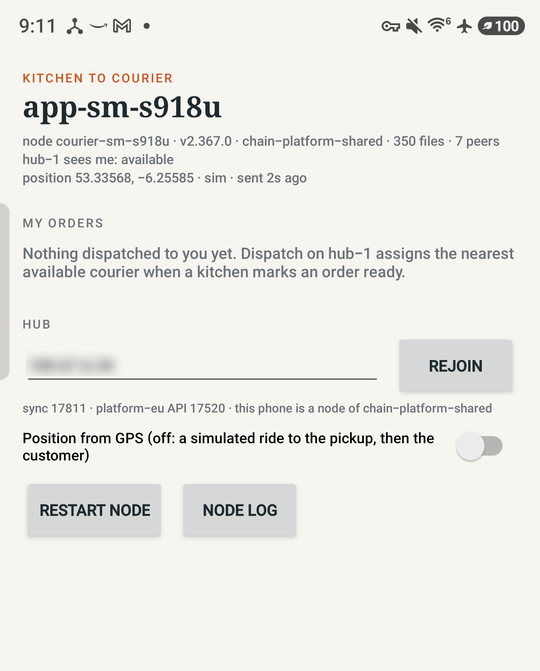
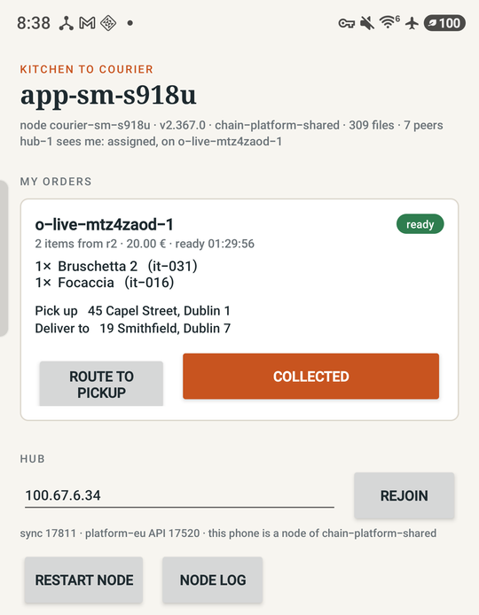
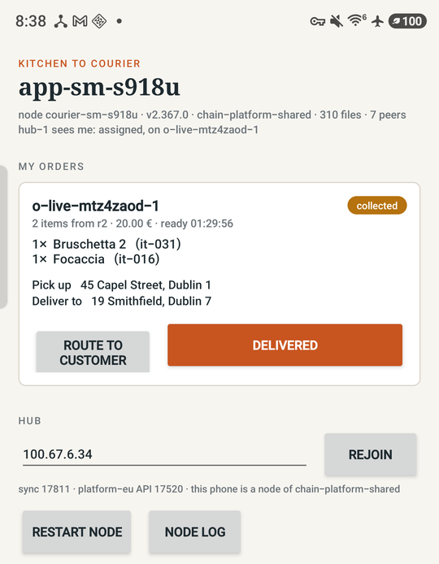
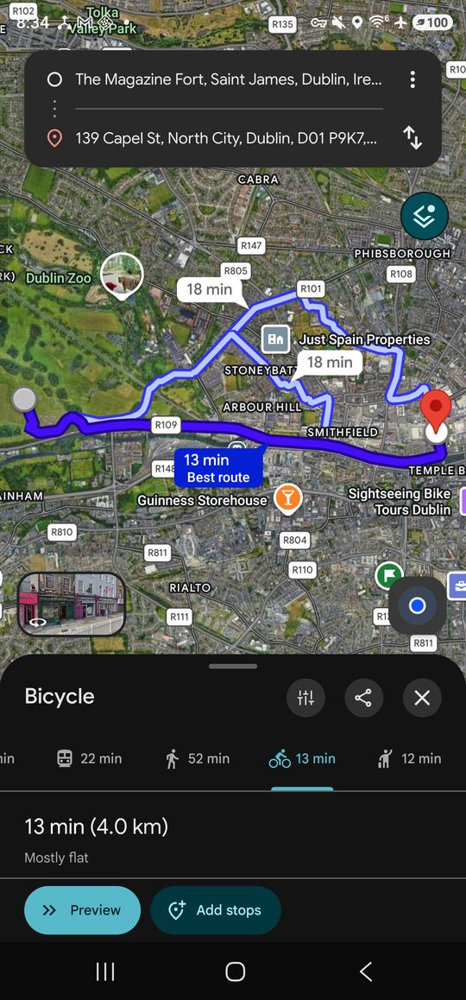
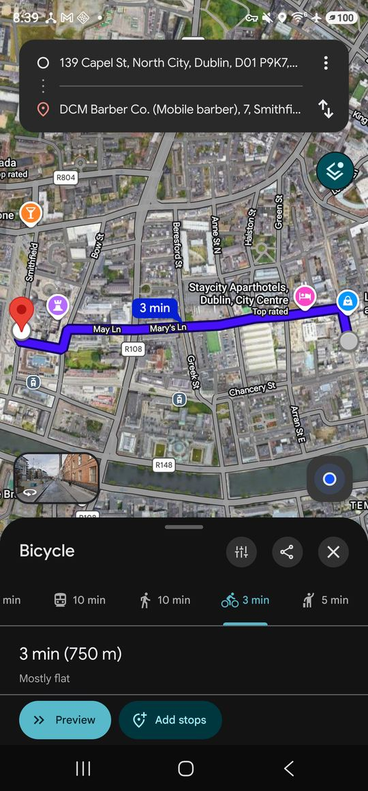
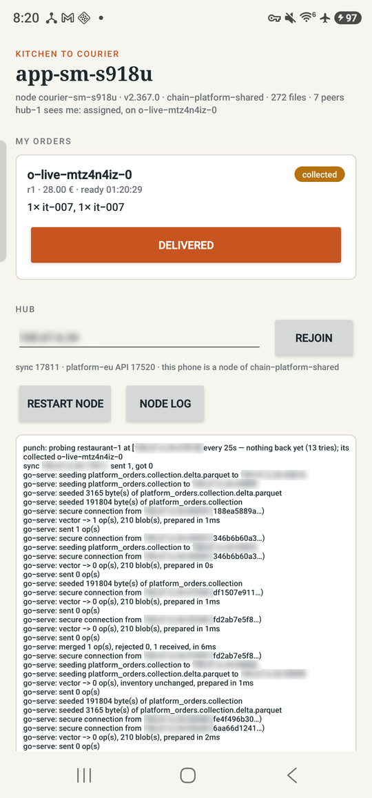

# Kitchen to Courier — the courier's phone as a node

An Android courier app for the
[kitchen-to-courier](https://www.unidatum.ie/en/blog/architecture-kitchen-to-courier)
architecture, built to show one thing: **the phone is not a client of a
server. It is a node.**

## What it is for

In the architecture, a restaurant chain and a delivery platform share one
library, `chain-platform-shared`, in which `platform_orders` lives. The
chain's kitchens write to it (accepted, ready), the platform's hubs write to
it (which courier), and the couriers write to it (collected, delivered). No
one owns the database; every party runs a node and holds a copy of what it
needs. The [MVP](https://github.com/OptimalMatch/kitchen-to-courier-mvp)
runs that as seven nodes in Docker with the apps simulated in JavaScript.

This app replaces one of the simulated couriers with a real phone. It
bundles the unidatum engine and runs a node of the shared library inside
the app. When the courier taps Collected, that is a write to the copy of
`platform_orders` on the phone. The hub learns about it on the next sync,
and from the hub the kitchen, the head office and the analytics node learn
about it in turn. If the phone loses the network, the courier still sees
the orders and the taps still land; they reach the hub when it is back.

Dispatch on the hub does not know the phone is different. The app registers
a `couriers` document on the platform's own library at hub-1's pickup point,
and the hub's dispatch rule, a geo query for the nearest available courier,
finds it the same way it finds the simulated ones.

## In action

The run below is against the MVP fleet (branch `main` after its PR #1) on
unidatum v2.367.0, with the phone, a Galaxy S23 Ultra, on the same Tailscale
network as the machine running compose.

### 1. Joined and waiting



The node is up inside the app: `courier-sm-s918u`, engine v2.367.0, a member
of `chain-platform-shared`, holding 246 files (the members of
`platform_orders` and `menu_published` it has replicated) and peered with 7 nodes (hub-1 and,
through it, the rest of the fleet). "hub-1 sees me: available" is read from
the platform's `couriers` collection on hub-1's other library. Nothing has
been dispatched.

### 2. Dispatched



A customer placed an order (`sims/customer.mjs`), restaurant r2's kitchen
accepted it and marked it ready, and hub-1's dispatch assigned it to the
nearest available courier: the phone. The hub wrote `courier_id` on the
order and `state: assigned` on the courier document. The phone's node pulled
the new member on its 5-second sync, the app's 3-second poll of its own node
found an order with its id, and the card appeared. The hub's log line for it
was `hub-1: o-live-mtz4zaod-1 -> app-sm-s918u`.

The card is what a courier checks the bag against at the counter: the line
count and total first, then each line by name. The order document itself
carries only item ids and prices; the names come from `menu_published`,
the chain's signed menu that its menu-publish pipeline lands in the shared
library. The phone replicates that table too, so the lookup is local. A
line that appears twice on the order is folded into one line with the
quantity summed. Below the lines are the two addresses the order carries:
`pickup` (the restaurant's, written by the platform when it created the
order) and `delivery` (the customer's).

### 3. Collected



The courier tapped Collected. The app ran one update on the node in the
phone: `{_id, status: ready} $set {status: collected, collected_at}`. The
status pill changed from the phone's own read, and the route button turned
to the customer. hub-1 saw the change 1.4 to 2.0 s later across the runs
(measured by polling hub-1's API from the host until the document
changed). Delivered is the same shape and also sets the courier document
back to `available` on the platform; it reached hub-1 in 1.5 to 2.0 s.

### The route

 

Route hands the phone's maps app a directions link built from the points
on the order document, bicycle mode. Before the order is collected the
route runs from the courier's position to the pickup (left: 13 min, 4.0 km
to Capel Street); after, from the pickup to the customer (right: 3 min,
750 m to Smithfield). The app draws no map of its own and needs no maps
API key; any maps app that takes a directions URL will do, and the browser
otherwise. In this demo the courier's position is the fixed point the app
registered at hub-1's pickup area, since the phone was not in Dublin.

### 4. What the node saw



The app's log panel shows the engine's own output. Reading down from
`collected o-live-mtz4n4iz-0`:

- `sync 100.67.6.34:17811: sent 1, got 0` — the phone pushed the one
  operation (its commit) to hub-1's shared node.
- `seeding platform_orders.collection.delta.parquet to 100.67.6.34:…` — the
  hub, and then five other nodes of the fleet (the different node ids in the
  `secure connection from` lines), came to the phone for the member that
  commit added. The phone is serving the fleet, not only consuming.
- `merged 1 op(s), rejected 0` — a commit from the hub side arriving on the
  phone, the dispatch's write.
- `punch: probing restaurant-1 at 100.67.6.34:47810` — the phone learned the
  other nodes' addresses from the hub, but only hub-1's shared port is
  published on the host, so those probes get no answer. The data still
  flows, through hub-1.

The order as hub-1 holds it afterwards, every field written by a different
party:

```
status:        delivered
courier_id:    app-sm-s918u
ready_at:      2026-09-13T01:20:29.330Z     kitchen r1
dispatched_at: 2026-09-13T01:20:30.088Z     hub-1 dispatch
collected_at:  2026-09-13T01:20:51.460954Z  the phone
delivered_at:  2026-09-13T01:21:18.396424Z  the phone
```

and hub-1's peer table lists the phone by the address it really has:
`courier-sm-s918u 100.107.235.10 47800`.

## What is in the APK

| file in `lib/arm64-v8a/` | what |
|---|---|
| `libunidatum.so` | the engine, the `android/arm64` release archive's `unidatum` |
| `libduckdb.so` | DuckDB's musl arm64 CLI, the engine's reader |
| `libmusl.so` | musl's loader, which runs it |
| `libstdcpp6.so`, `libgccs1.so` | its two libraries, from Alpine |
| `libduckwrap.so` | a shell script the engine gets as `P2PFS_DUCKDB` |

Android runs a native executable an app ships only from the app's own
native-library directory, and the packager takes only `lib*.so` names —
hence the names, and `patchelf` rewriting the DT_NEEDED entries to match,
including the transitive ones (libstdc++ asks for libgcc_s by name).
`tools/fetch-natives.sh` produces all six (gh access to the release repo,
`patchelf`, `curl`). They are 106 MB and stay out of git.

The node runs as a foreground service (`NodeService`): `init` once into
`filesDir/node` as `courier-<model>`, then `ui --port 47800 --ui-port 7480
--dht-port 47801 --bind 0.0.0.0 --sql --no-mdns --seed-open --sync-every 5`.
The app talks to it at `http://127.0.0.1:7480` with the same calls the MVP's
`lib/api.mjs` makes.

## The courier's calls (`Courier.kt`)

| step | call | where |
|---|---|---|
| join | `POST /api/sync {host, port: 17811}` then `POST /api/table/replicate` for `platform_orders` and `menu_published` | the phone's node |
| register | `POST /api/doc/put couriers {_id: app-<model>, hub_id: hub-1, state: available, location near hub-1's pickup}` | platform-eu, hub-1's API (17520) |
| 4 | `POST /api/doc/find platform_orders {courier_id: mine, status: {$in: [ready, collected]}}` every 3 s | the phone's node |
| 4 | `POST /api/sql SELECT restaurant_id, item_id, name, price_cents FROM menu_published`, cached a minute, to name the lines | the phone's node |
| 5 | `POST /api/doc/update {_id, status: ready} $set {status: collected, collected_at}` | the phone's node |
| 5 | `$set {status: delivered, delivered_at}`, then `couriers $set {state: available, current_order: null}` | the phone's node; platform-eu |

Before a write the app fetches any member of the collection the node does not
hold yet (`/api/files` + `/api/fetch`), as the MVP's `ensureLocal` does.

## Build and run

```sh
tools/fetch-natives.sh v2.367.0          # once; needs gh auth for the release repo
JAVA_HOME=~/jdk/jdk17 ANDROID_HOME=~/android-sdk ./gradlew assembleDebug
adb install -r app/build/outputs/apk/debug/app-debug.apk
```

Or install the APK from the [releases](../../releases).

On the MVP side: `bin/demo-up.sh`, then set the hub host in the app to the
machine running compose (a Tailscale or LAN address the phone reaches).
Place orders with `docker compose run --rm tools node sims/customer.mjs`;
the nearest available courier to hub-1's pickup is the phone, so dispatch
assigns them to it and they appear on the phone with a Collected button.

Ports on the phone: 7480 (API, bound on all interfaces so a laptop on the
same network can query the phone's copy), 47800 sync, 47801 DHT.

## Limits

- arm64 only, Android 10+; the engine is a static Go binary, DuckDB is the musl build.
- The courier's location is fixed at hub-1's pickup; a real app would write GPS fixes to its `couriers` document and route from them.
- Until the menu table's members have landed, the names come through hub-1 (the node answers the query by asking its peers), and a pickup with no network would show item ids. Landing them needs unidatum after v2.367.0: the phone sees head-office and hub-1 at one address on two ports, and older engines kept only the first, unpublished one (fixed in peer-to-peer-db PR #1046).
- One hub (`hub-1`) and the MVP's port numbers are constants in `Courier.kt`; only the host is editable in the app.
- The phone reaches the rest of the fleet only through hub-1, since only hub-1's shared port is published by compose.
- The debug build only. A release build needs a signing key; no ProGuard rules are written.
